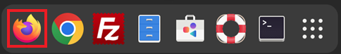
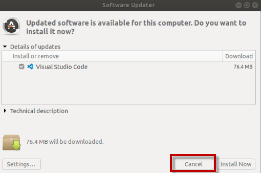

# Lab: Getting Started with Liberty and Dev Mode

## Objectives

In this exercise, you will learn how developers can use Liberty in “dev”
mode for achieving efficient iterative develop, test, debug cycle when
developing Java based applications / microservices.

At the end of this lab you should be able to:

  - Use Liberty dev mode (stand-alone) without an IDE

  - Experience hot reloading of application code and configuration
    changes using dev mode

  - Work with Liberty dev mode in containers

  - Run integrated unit/integration tests from Liberty dev mode

You will need an estimated **45 to 60 minutes** to complete this lab.

## Lab requirements

  - Use the lab environment that we prepared for this lab. It already
    has the prerequisite software installed and configured.
    

## Introduction - Liberty and "dev" Mode

**Open Liberty** is an application server designed for the cloud. It’s
small, lightweight, and designed with modern cloud-native application
development in mind.

Open Liberty supports the full MicroProfile and Jakarta EE APIs and is
composable, meaning that you can use only the features that you need,
keeping the server lightweight, which is great for microservices. It
also deploys to every major cloud platform, including Docker,
Kubernetes, and Cloud Foundry.

**Maven** is an automation build tool that provides an efficient way to
develop Java applications. Using Maven, you will build a simple
microservice, called **system**, that collects basic system properties
from your laptop and displays them on an endpoint that you can access in
your web browser.

Open Liberty **development mode**, or dev mode, allows you to develop
applications with any text editor or IDE by providing hot reload and
deployment, on demand testing, and debugger support. Open Liberty Dev
Mode is enabled through **Maven** and **Gradle** projects.

Your code is automatically compiled and deployed to your running server,
making it easy to iterate on your changes.

You can run tests on demand or even automatically so that you can get
immediate feedback on your changes. You can also attach a debugger at
any time to debug your running application.

## Accessing the lab environment

If you are doing this lab as part of an instructor led workshop (virtual or face to face), an environment has already been provisioned for you. The instructor will provide the details for accessing the lab environment.

Otherwise, you will need to reserve an environment for the lab. You can obtain one here. Follow the on-screen instructions for the “**Reserve now**” option.

<https://techzone.ibm.com/my/reservations/create/660d7f062945d2001e009449>

 The lab environment contains one (1) Linux VM, named **Workstation**.

  
    
  The Ubuntu Linux **Workstation** VM has the following software installed for the lab:
  
  - Maven 3.6.0 
  - IBM Semeru Runtime Open Edition 17.0.8.1

   

1. Access the lab environment from your web browser. 
    
    A `Published Service` is configured to provide access to the **Workstation** VM through the noVNC interface for the lab environment.
    
    a. When the demo environment is provisioned, click on the **environment tile** to open its details view. 

    b. Click on the **Published Service** link which will display a **Directory listing**  
    
    c. Click on the **"vnc.html"** link to open the lab environment through the **noVNC** interface. 
    
    
    
    d. Click the **Connect** button 
    
      

    e. Enter the password as:  **`IBMDem0s!`**. Then click the **`Send Credentials`** button to access the lab environment. 

    > Note: That is a numeric zero in IBMDem0s!  

      <kbd></kbd>

	 
	  

2. If prompted to Login to the "workstation" VM, use the credetials below: 

    The login credentials for the **workstation”** VM is:
 
     - User ID: **techzone**

     - Password: **IBMDem0s!**

     > Note: That is a numneric zero in the password

	  
 
     <kbd></kbd>
	 
	  
	
3.  Once you access the **Student VM** through the published service, you will see the Desktop, which contains all the programs that you will be using (browsers, terminal, etc.)

   

## Tips for working in the lab environment     

1. You can resize the viewable area using the **noVNC Settings** options to resize the virtual desktop to fit your screen.

    a. From the environemnt VM, click on the **twisty** on the noNC control pane to open the menu.  

    

    b. To increase the visible area, click on `Settings > Scaling Mode` and set the value to `Remote Resizing`
      
     

2.  You can copy / paste text from the lab guide into the lab environment using the clipboard in the noVNC viewer. 
   
    a. Copy the text from the lab guide that you want to paste into the lab environment
    
    b. Click the **Clipboard** icon and **paste** the text into the noVNC clipboard

    
    
    c. Paste the text into the VM, such as to a terminal window, browser window, etc. 

    d. Click on the **clipboard** icon again to close the clipboard

    > **NOTE:** Sometimes pasting into a Terminal window in the VM does not work consistently. 
    
    > In this case you might try again, or open another Terminal Window and try again, or  paste the text into a **Text Editor** in the VM, and then paste it into the Terminal window in the VM. 
 

3. An alternative to using the noVNC Copy / Paste option, you may consider opening the lab guide in a web browser inside of the VM. Using this method, you can easily copy / paste text from the lab guide without having to use the noVNC clipboard. 
 

<!-- LBH: Added description how to access toolbar -->
4. Click on the **`Activities`** icon within the VM to switch between different windows or get access the tool bar.
    <kbd></kbd>

    You will see the toolbar.

    <kbd></kbd>
    
     

### If, at aytime during the lab, you ar asked to install updates, click CANCEL!

|         |           |  
| ------------- |:-------------|
|    | 
<strong>Important:</strong> 
<strong>Click CANCEL</strong>…. If, at any time during the lab, you get a pop-up asking to install updated software onto the Ubuntu VM.
 
The one we experience is an update available for VS Code.

<strong>CLICK CANCEL!</strong>

 |

 

## Getting Started with Liberty and Dev Mode

In this lab, you will learn how to run and update a simple REST
microservice on an Open Liberty server using the developer mode (dev
mode). You will use Maven throughout the guide to build and run the
microservice as well as to interact with the running server instance.

### **Building and running the application using Maven and the liberty-maven-plugin**

The sample application used in this lab is configured to be built with
Maven. Every Maven-configured project contains a pom.xml file, which
defines the project configuration, dependencies, plug-ins, and so on.

Your pom.xml file is located in the root directory of the project and is
configured to include the liberty-maven-plugin, which allows you to
install applications into Open Liberty and manage the server instances.

To begin, navigate to the project directory. Build the “**system”**
microservice that is provided and deploy it to Open Liberty by running
the Maven **liberty:run** goal:

1.  Use the **Activities** Icon to switch to the toolbar, then click the **Terminal** icon to open a Terminal window.

    <!-- LBH: Updated description how to access toolbar -->

    <kbd></kbd>

2.  Clone the GitHub repo that includes artifacts required for this lab
    <!-- LBH: Adjusted lab to use Student folder instead of home to store content -->

        mkdir -p /home/techzone/Student/labs

        git clone https://github.com/openliberty/guide-getting-started.git /home/techzone/Student/labs/devmode
        
        cd /home/techzone/Student/labs/devmode

    Once completed, the local lab artifacts repo is cloned at the following directory on the desktop VM. 
    
    > **/home/techzone/Student/labs/devmode**

3. To begin, navigate to the start directory. Build the “**system”**
    microservice that is provided and deploy it to Open Liberty by
    running the Maven **liberty:run** goal:
    
    a.  Open a terminal window and change to the directory
        **/home/techzone/Student/labs/devmode/start**

        cd /home/techzone/Student/labs/devmode/start

    b.  Run the mvn libert:run command to start the Liberty server
        
        mvn liberty:run

    The mvn command initiates a **Maven build**, during which the target directory is created to store all build-related files.
 
    The **liberty:run** argument specifies the Open Liberty run goal,which starts an Open Liberty server instance in the foreground.
 
    As part of this phase, an Open Liberty server runtime is downloaded
    and installed into the target/liberty/wlp directory, a server instance is created and configured in the target/liberty/wlp/usr/servers/defaultServer directory, and the application is installed into that server.
 
    When the server begins starting up, various messages display in your command-line session. Wait for the following message, which indicates that the server startup is complete:
 
    **The server defaultServer is ready to run a smarter planet.**

    <kbd></kbd>

     

2.  Access the “system” microservice that was deployed to the Liberty
    server.
    
    a. Use the **Activities** Icon to switch to the toolbar, then click the **Firefox** icon to open a Firefox browser window.

    <!-- LBH: Updated description how to access toolbar -->

    <kbd></kbd>
    
    Go to the URL below. The microservice lists various system properties of
        your JVM.

        http://localhost:9080/system/properties
    
    <kbd></kbd>

     

3.  **Stop** the Liberty Server by pressing the **CTRL+C** in the
    command-line session where you ran the server.

4.  Start and Stop the Liberty server in the background

    Although you can start and stop the server in the foreground by using the Maven liberty:run goal, you can also start and stop the server in the background with the Maven **liberty:start** and **liberty:stop** goals:

        mvn liberty:start

        mvn liberty:stop

5.  View the **pom.xml** file to see the liberty-maven-plugin that was used by the previous steps.
    
    a.  From a Terminal window, navigate to the following directory
     
        cd /home/techzone/Student/labs/devmode/start

    b.  View the relevant plugin in the pom.xml file. The -A and -B options on the grep command display the specified number of lines before and after the location of the search text string.

        cat pom.xml | grep -B 4 -A 2 liberty-maven-plugin

    <kbd></kbd>

|         |           |  
| ------------- |:-------------|
|    | 
<strong>Information:</strong>
 
<strong>Tip:</strong> Additional information on the liberty-maven-plugin can be found here:

<a href="https://github.com/OpenLiberty/ci.maven">https://github.com/OpenLiberty/ci.maven</a>
 |

 

### **Updating the application without restarting the server**

The Open Liberty Maven plug-in includes a **dev** goal that listens for
any changes in the project, including application source code or
configuration changes. The Open Liberty server automatically reloads the
application and configuration without restarting. This goal allows for
quicker turnarounds and an improved developer experience.

1.  Start the Liberty server in “dev” mode
    
    a.  From a Terminal window, navigate to the following directory

        cd /home/techzone/Student/labs/devmode/start

    b.  Ensure the Liberty server is STOPPED\!

        mvn liberty:stop

    c. Start Liberty in dev mode

        mvn liberty:dev

    **Note:** The Liberty is now started in dev mode.

    <kbd>

    Dev mode automatically picks up changes that you make to your application and allows you to run tests by pressing the **enter/return** key in the active command-line session. When you’re working on your application, rather than rerunning Maven commands, press the enter/return key to verify your change, which executes your tests.

     

2.  Access the “system” microservice that was deployed to the Liberty server.
    
    a.  Open the Web Browser from inside of the VM and go to the URL below to display the main application web page

        http://localhost:9080/ 

    <kbd></kbd>

     

3.  Make a minor change to the “system Properties Sample” source code
    while running in dev mode, to see the changes dynamically picked
    up and applied to the running server.
    
    a. Click on **Activities** to access the **Toolbar**, then right-click on **Terminal** to open a **new terminal window**.
    
    <kbd></kbd>

    
    b. In the new terminal window, navigate to **src/main/webapp** folder of the application as illustrated below.

        cd /home/techzone/Student/labs/devmode/start/src/main/webapp

    c.  Use the gedit editor to open the **index.html** file in edit mode

        gedit index.html
        
    c.  Make the following minor change to the index.html page on or about line number 25.

    **Change title in the highlighted line:**
 
    <kbd></kbd>

    **Updated title:** System Properties Demo

    <kbd></kbd>

    d.  **Save** the file and **close** the gedit editor.

     

4.  Access the **System Properties Sample** microservice that was deployed to the Liberty server.

    a.  From the Web Browser inside of the VM, and go to the URL below to display the main application web page

        http://localhost:9080/

    b.  **IMPORTANT**: Click the **RELOAD** icon in the browser to reload the page. Browsers cache content, so you need to reload the page.
    
    <kbd></kbd>

    c.  The updated index.html page is displayed with your changes
    dynamically picked up 

    <kbd></kbd>

    The application code changes were detected and dynamically applied to the running instance of the Liberty server.

     

### **Updating the Server configuration without restarting the server**

The Open Liberty Maven plug-in’s **dev goal** not only listens for
application code changes, but also **configuration changes** in the
project. The Open Liberty server automatically reloads the configuration
without restarting. This goal allows for quicker turnarounds and an
improved developer experience.

In this section, you make a simple configuration change in the Liberty
Server configuration file (server.xml) of the project (src), to include
a **/health** endpoint for the service. You will notice that the changes
are detected by maven and dynamically updated on the target server.xml.
The running Liberty instance automatically picks up the changed target
configuration

If you try to access this /health endpoint now, you see a 404 error
because the **/health** endpoint does not yet exist:

1.  From the Web browser in the VM, try to access the applications /health endpoint at:

        http://localhost:9080/health

    > Note: you see a 404 error because the **/health** endpoint does not yet exist
 
    <kbd></kbd>

     

2.  Make a simple change to the Liberty Server configuration file to add **the mpHealth-4.0** feature to the server.xml file, which enables the health check endpoint.
    
    a  From a terminal window, navigate to **liberty/config** folder of the application

        cd /home/techzone/Student/labs/devmode/start/src/main/liberty/config

    b.  Use the gedit editor to open the **server.xml** file in edit mode

        gedit server.xml

    c.  Make the following minor change to the server.xml file

    **Add a line to the featureManager section:**
 
    <kbd></kbd>

    **Updated to include:** \<feature\>mpHealth-4.0\</feature\>

    <kbd></kbd>

    d.  **Save** the file and **close** the gedit editor.

     

3.  Access the new **Health Endpoint** for the application.

    a.  Open the Web Browser from inside of the VM and go to the URL below to display the health endpoint.

        http://localhost:9080/health

    <kbd></kbd>

     

4.  View the Liberty server console log to see the **mpHealth-4.0** feature was installed, and the health endpoint enabled.

    a.  Return to the Terminal window where the **mvn liberty:dev** is
    running.

    b.  Review the messages that indicate the **mpHealth-4.0** feature was dynamically installed and the **/health** endpoint enabled.
    
    <kbd></kbd>

    The Liberty server configuration changes were detected and dynamically applied to the running instance of the Liberty server.

    The **/health** endpoint reports whether the server is running, but the endpoint doesn’t provide any details on the microservices that are running inside of the server.

    **MicroProfile Health** offers health checks for both readiness and liveness.

      - A **readiness** check allows third-party services, such as Kubernetes, to know if the microservice is ready to process requests.

      - A **liveness** check allows third-party services to determine if the microservice is running.
    
     **Note:** Working with MicroProfile Health is beyond the scope of
    this lab and is introduced in a subsequent lab.

     

5. From the terminal window that is running "mvn:liberty:dev", use **CTL-C** to stop the Liberty server. 

## Developing and Running the application in a Docker Container and in Liberty Dev Mode

When developing an application that will eventually be deployed to
production in **containers**, you can avoid potential issues by ensuring
that your development and production environments are as similar as
possible. This aligns with [Twelve Factor
App](https://openliberty.io/blog/2019/09/05/12-factor-microprofile-kubernetes.html)
methodology, particularly factor 10, which calls for dev/prod parity.
For cloud-native applications, part of this issue is addressed by using
containers where your environment can be codified to provide consistency
between development and production.

In this section of the lab, you will use **Liberty dev mode with
containers**. With container support, you can develop applications on
your local environment while your Open Liberty server runs in a
container.

The development container image is kept as similar as possible to the
production container image, while still allowing for iterative
development. Your code changes are automatically hot deployed to the
container and picked up by the running server. Additionally, dev mode
allows you run tests either automatically or on demand, and you can
attach a debugger at any time to debug your application.

With container support for Open Liberty dev mode, you can use the same
**Dockerfile** for both development and production. You use the same
base image and customizations, and you specify the exact configuration
files that you need for your application in your Dockerfile. This
prevents you from running into any surprises when you deploy your
application to production.

Dev mode changes how the image is built and run to enable iterative
development, so the images are identical except for how application and
configuration files are mounted into the containers. With dev mode,
simply save a source file in any text editor or IDE, and it is
recompiled and picked up without any need to rebuild the image or
restart the server.

### **Investigate Docker Commands and Dockerfile for building images**

This section is a primer on how to use, build, deploy and run Liberty in a Docker container. You will pull Liberty from Docker hub, install it, review information about the container, access resources inside the
container, add an application then test it.

To run the application in a container, Docker needs to be installed and
the Docker daemon running. In this lab environment, these prerequisites
have been configured.

1. From the terminal window, use **CTL-C** to stop the Liberty server, if it is still running from the previous section. 

2.  In the Terminal window, verify that Docker is running

        docker --version

    <kbd></kbd>

     

3. Run the **hello-world** docker sample. The docker image will be pulled from Dockerhub if it is not already on the local machine. If Docker is functioning properly, you will see the highlighted message illustrated below, stating that Docker is working properly.

        docker run --name hello-world hello-world 

    <kbd></kbd>

     

4.  Use the **docker images** command to find out which Docker images are in the local docker repository

        docker images hello-world

    <kbd></kbd>

     

5.  Use the docker history command to view the layers that make up the Docker image

        docker history hello-world

    <kbd></kbd>

     

6.  Let’s run a Liberty image Docker container. Docker will check if there is an image in the repository. If not, it will download the latest image, then run it

        docker run -d -p 9086:9080 --name wlp websphere-liberty

    <kbd></kbd>

     

7.  Review the containers information.
    
    a.  The **docker ps** command lists only **running** containers. The docker **ps -a** command shows all containers, running or     stopped.

        docker ps | grep liberty

    <kbd></kbd>

    b.  The **docker stats** command shows resource usage of the running containers. Use the **Ctrl + C** keys to stop stats

        docker stats

    <kbd></kbd>

     

8.  Open the Web browser on the VM and access Liberty running in the container: **http://localhost:9086**

    <kbd><kbd>

     

9.  Look at the Liberty logs in the running container

        docker logs wlp

    <kbd></kbd>

     

10.  **Stop** and **remove** the docker containers used in this section of the lab. Then use the **docker ps -a** command to verify the "**wlp**" and "**hello-world**" containers are removed.

         docker stop wlp

         docker rm wlp

         docker rm hello-world

         docker ps -a

    

### **Running the application in a container**

To run the application in a container, Docker needs to be installed and
the Docker daemon running. In this lab environment, these prerequisites
have been configured.

First, to containerize the application, you need a **Dockerfile**. This
file contains a collection of instructions that define how a Docker
image is built, what files are packaged into it, what commands run when
the image runs as a container, and other information.

For this lab, a **Dockerfile** has been provided to build the docker
image for the System Properties Sample. This Dockerfile copies the
**.war** file into a Docker image that contains the Java runtime and a
preconfigured Open Liberty server.

1.  From a Terminal window, STOP the running Liberty Server from the previous section of the lab, using the commands below:

        cd /home/techzone/Student/labs/devmode/start

        mvn liberty:stop

2.  View the Dockerfile that is used to build the docker image.
    
    a.  Open a terminal window and change to the directory:
        **/home/techzone/Student/labs/devmode/start**

        cd /home/techzone/Student/labs/devmode/start

    b.  Investigate the Dockerfile

        cat Dockerfile

    **The Dockerfile performs the following tasks:**

    <kbd></kbd>

    **Read below for a short description and details of the commands in the Dockerfile:**

    - **FROM openliberty/open-liberty:kernel-java11-openj9-ubi**
    
        FROM specifies the Docker image that is to be used. If this is not in the local repository, this will be pulled from Docker Hub.
    
        In this example, we pull the liberty kernel image that contains Java 11, and uses the RedHat Universal base Images for deployments to OpenShift.
    
        The **kernel** image contains just the Liberty kernel and no additional runtime features. This image is the recommended basis for custom built images, so that they can contain only the features required for a specific application

        

    - **ARG VERSION=1.0 and ARG REVISION=SNAPSHOT**
    
        The ARG instruction defines variables that can be passe at build time. Once it is defined in the Dockerfile, you can pass it with the flag **--build-arg**.

    

    - **LABEL**
    
        Labels are used in Dockerfile to help organize your Docker Images. Labels are key-value pairs and simply adds custom metadata to your Docker Images.

    

    - **COPY --chown=1001:0 src/main/liberty/config/ /config/**
    
        The COPY command will copy the liberty configuration file (server.xml) to the /config folder in the Liberty container.
    
        The RedHat Universal Base Images (UBI) are built such that Liberty does not run as root. To ensure that Liberty can access the files that are copied to the image, they must be owned by a non-root user.

        All Liberty images from IBM contain a non- root user defined as **1001:0**. So the copy command copies the files as the non-root user that is known to exist on the LIBERTY image.

    
    - **RUN features.sh**
    
        The features.sh script will add the requested XML snippets to enable Liberty features and grow the image to be fit-for-purpose using featureUtility.

         
    

    - **COPY --chown=1001:0 target/\*.war /config/apps/**
    
        The COPY command will copy the application WAR file to the /config/apps directory on the image.

        

    - **RUN configure.sh**
    
        The configure.sh script will add the requested server configurations, apply any interim fixes and populate caches to optimize the runtime.

         

3.  Run the **mvn package** command from the **start** directory. The command will produce a war file named "**guide-getting-started.war**” and copied to the “**target**” directory.

        mvn package

    <kbd></kbd>
    <kbd></kbd>

    The Maven package command builds the application and produces an application deployable binary “.war” file that is copied into the Docker image via the Dockerfile.

     

4. Run the following command to download or update to the latest Open Liberty Docker image used in our Dockerfile:

        docker pull icr.io/appcafe/open-liberty:kernel-slim-java11-openj9-ubi

    **Note:** If the image has already been pulled onto this VM, you may only see a message indicating the image is already up to date, rather than pulling the image again.

    <kbd></kbd>
    or
    <kbd></kbd>

     

5.  To build and containerize the application, run the following Docker build command. Be sure you are in the directory that contains the Docker file.
    
    **Note:** The **dot** at the end of the docker build command is part of the command, indicating to use the current directory path.

        cd /home/techzone/Student/labs/devmode/start

        docker build -t openliberty-getting-started:1.0-SNAPSHOT .

    <kbd></kbd>

    The Docker **openliberty-getting-started:1.0-SNAPSHOT** image is built from the **Dockerfile**.

     

6.  To verify that the image is built, run the **docker images** command to list all local Docker images

        docker images | grep getting-started

    Your image should be listed as “**openliberty-getting-started**” with the TAG of “**1.0-SNAPSHOT**”

    <kbd></kbd>

     

7.  Next, run the container from the image.

        docker run -d --name gettingstarted-app -p 9080:9080 openliberty-getting-started:1.0-SNAPSHOT

    <kbd></kbd>

    There is a bit going on in that command; so, here is a short description of the parameters on the command. And the final argument on the command is the Docker image name.

    

     

8.  Run the **docker ps** command to verify your docker container is  running

        docker ps -l

    <kbd></kbd>

     

9.  From a Web Browser, access the application using:
    **http://localhost:9080/system/properties**
    
    <kbd></kbd>

     

10. Stop and Remove the Docker container

        docker stop gettingstarted-app

        docker rm gettingstarted-app

     

11. Remove the Docker image

        docker rmi openliberty-getting-started:1.0-SNAPSHOT

     

### **Using Dev mode to develop an application in a Docker container**

The Open Liberty Maven plug-in includes a **devc** goal that simplifies
developing your application in a Docker container by starting dev mode
with container support.

This **devc** goal builds a Docker image, mounts the required
directories, binds the required ports, and then runs the application
inside of a container. Dev mode also listens for any changes in the
application source code or configuration and rebuilds the image and
restarts the container as necessary.

1.  Build and run the container by running the devc goal from the start directory:

        mvn liberty:devc

    a.  When you see the message: “**Liberty is running in dev mode**”, Open Liberty is ready to run in dev mode:
    
    <kbd></kbd>
    
     

    |         |           |  
    | ------------- |:-------------|
    |    | 
<strong>IMPORTANT:</strong>

In the console, you might see error like this: 

You can ignore those messages.
     |

2.  Open another Terminal window and run the **docker ps** command to verify that the container is started.

        docker ps -l

    <kbd></kbd>

     

3.  From a Web Browser, access the application using:
    **http://localhost:9080/system/properties**
    
    <kbd></kbd>
    
    Dev mode automatically picks up changes that you make to your
    application and allows you to run tests by pressing the
    **enter/return** key in the active command-line session.

     

4.  Run the integration test that is included in the application project.
    
    **Note:** The test case simply creates a client and invokes the
    <http://localhost:9080/system/properties> endpoint. 
    
    The expected HTTP response code is 200, which indicates a successful http response from the system/properties service. The test case will fail if the response code is anything other than 200.
    
    a.  From the Terminal window that the **mvn liberty:devc** is
        running, press the **ENTER** key to run the tests. You will see
        that the test runs with no failures, as illustrated below.
        
    <kbd></kbd>

    |         |           |  
    | ------------- |:-------------|
    |    | 
<strong>IMPORTANT:</strong>

Next, you will introduce a change to the system/properties endpoint, which will break the test.

In this lab, you will not go into detail on the test cases themselves because you will explore testing in greater detail in a subsequent lab when working with Liberty dev mode in the VS Code IDE.
 |

5.  Update the **server.xml** file to change the context root from **/** to **/dev**
    
    a.  From a terminal window, navigate to the **liberty config**
        folder of the application

        cd /home/techzone/Student/labs/devmode/start/src/main/liberty/config 

    b.  Use the gedit editor to open the **server.xml** file in edit mode

        gedit server.xml

    c.  Make the following minor change to the server.xml file

    **In the webApplication element, change the highlighted contextRoot:**
 
    <kbd></kbd>

    **Updated contextRoot element:** contextRoot="/**dev**" /\>

     <kbd></kbd>

    d.  **Save** the file and **close** the gedit editor.

     

6.  After you **SAVE** the file changes, Open Liberty automatically reloads its configuration. You can access the application at: **http://localhost:9080/dev/system/properties**
    
    Notice that context root is now **/dev**
    
    <kbd></kbd>

     

    |         |           |  
    | ------------- |:-------------|
    |    | 
<strong>IMPORTANT:</strong>

We encountered situations where the container got mapped to Docker host port 9081 instead of 9080.

This happens when the new container comes up before the old container ports have been freed. To get the container back to port 9080, restart devc or do a minor change to the server.xml..
 |

7.  Rerun the integration test that is included in the application roject.
    
    a.  From the Terminal window that the **mvn liberty:devc** is
        running, press the **ENTER** key to run the tests. You will see
        that the test runs, but now FAILS because a 404 HTTP response
        code was returned, using the original context root.
        
    <kbd></kbd>
        
    **Note:** For the test case to **PASS**, the test case itself would need to be updated to reflect invoking the system/properties service using the new /dev context root. This activity is beyond the scope of this lab. However, you will explore the tests in greater detail in a subsequent lab.

     

## Lab cleanup and completion

1.  **Exit** Liberty devc mode
    
    a.  When you are finished, **exit** dev mode by pressing **CTRL+C**
        in the command-line session that the container was started from, or by typing q and then pressing the enter/return key.
        
    **Note:** Either of these options stops and removes the container.
    
    b.  To check that the container was stopped, run the **docker ps**  command.

        docker ps | grep getting-started

    <kbd></kbd>

    c. Optionally remove the devmode lab

        rm -rf /home/techzone/Student/labs/devmode

    d. **Close** all **Terminal** windows and **Browser** tabs used in the lab.

**Congratulations**\! You have successfully completed the lab “Getting
Started with Liberty and Dev Mode.

In this exercise, you learned how developers can use Liberty in “dev”
mode for achieving efficient iterative develop, test, debug cycle when
developing Java based applications / microservices.

You explored:

  - Using Liberty dev mode (stand-alone) without an IDE

  - Hot reloading of application code and configuration changes using
    dev mode

  - Working with Liberty dev mode in containers

  - Running integrated unit/integration tests from Liberty dev mode
    
    **===== END OF LAB =====**
