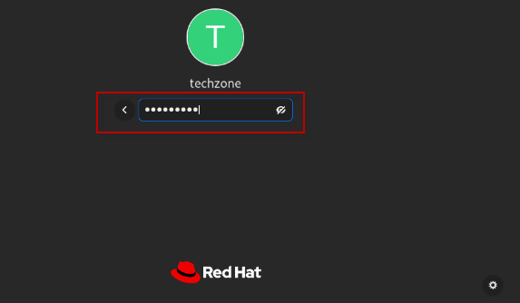

# Lab: Using Open Liberty Tools with VS Code

## Objectives

In this exercise, you will learn how developers can use Liberty in “dev” mode with VS Code Integrated Development Environment for achieving efficient iterative develop, test, debug cycle when developing Java based applications and microservices.

At the end of this lab you should be able to:

  - Experience using the Open Liberty Tools extension available in VS
    Code to efficiently develop, test, and debug Java cloud native
    applications.

  - Experience hot reloading of application code and configuration
    changes using dev mode

You will need an estimated **60 to 90 minutes** to complete this lab.

## Lab requirements

  - Use the lab environment that we prepared for this lab. It already has the prerequisite software installed and configured.
    
## Introduction – Open Liberty Tools extension for VS Code

In a separate lab, you learned how Open Liberty dev mode can be run from a command line while allowing you to edit your code with any text editor or IDE.

In this lab, you will use the “**Open Liberty Tools”** **VS Code
extension** to start Open Liberty in development mode, make changes to
your application while the server is up, run tests and view results, and
even debug the application without leaving the editor.

Your code is automatically compiled and deployed to your running server,
making it easy to iterate on your changes.

The Open Liberty Tools for VS Code contains the following key Features

  - View **liberty-maven-plugin projects** in the workspace (version 3.1
    or higher)

  - View **liberty-gradle-plugin projects** in the workspace (version
    3.0 or higher)

  - Start/Stop Open Liberty Server in dev mode

  - Start Open Liberty Server dev mode with custom parameters

  - Run Unit and Integration tests

  - View unit and integration test reports

The Open Liberty Tools for VS Code has a dependency on the **Tools for
MicroProfile** VS Code extension to support the development of MicroProfile based microservices.

The **Tools for MicroProfile** VS Code extension has dependencies on the following:

  - Java JDK (or JRE) 11 or more recent

  - Language Support for Java by Red Hat VS Code extension.

### **Liberty Maven Plugin**

The **Liberty Maven Plugin** provides several goals for managing a
Liberty server and applications.

Maven 3.5.0 or later is recommended to use the Liberty Maven Plugin.

Enabling the Liberty Maven Plugin in your project, simply add the
following XML Stanza to your **pom.xml** file.

For detailed infromation about the Maven goals supported by the Liberty
Maven Plugin, visit:

<https://github.com/OpenLiberty/ci.maven>

### **Interacting with dev mode**

Once the **Liberty Maven Plugin** is specified in your **pom.xml** file,
your project name is then listed under the **Liberty Dev Dashboard** in
the side panel in VS Code, as illustrated below.

You can interact with dev mode by right-clicking on your project name
and selecting one of the commands supported by the Open Liberty Tools
extension.

> 

### **Liberty dev mode Commands**

The following commands can be selected from the drop-down menu after
right-clicking on your project name in the Liberty Dev Dashboard.

     

## Accessing the lab environment

If you are doing this lab as part of an instructor led workshop (virtual or face to face), an environment has already been provisioned for you. The instructor will provide the details for accessing the lab environment.

Otherwise, you will need to reserve an environment for the lab. You can obtain one here. Follow the on-screen instructions for the “**Reserve now**” option.

<https://techzone.ibm.com/my/reservations/create/660d7f062945d2001e009449>

 The lab environment contains one (1) Linux VM, named **Workstation**.

  
    
  The Ubuntu Linux **Workstation** VM has the following software installed for the lab:
  
  - Maven 3.6.0 
  - IBM Semeru Runtime Open Edition 17.0.8.1
  - Visual Studio Code 1.85.1

   

1. Access the lab environment from your web browser. 
    
    A `Published Service` is configured to provide access to the **Workstation** VM through the noVNC interface for the lab environment.
    
    a. When the demo environment is provisioned, click on the **environment tile** to open its details view. 

    b. Click on the **Published Service** link which will display a **Directory listing**  
    
    c. Click on the **"vnc.html"** link to open the lab environment through the **noVNC** interface. 
    
    
    
    d. Click the **Connect** button 
    
      

    e. Enter the password as:  **`IBMDem0s!`**. Then click the **`Send Credentials`** button to access the lab environment. 

    > Note: That is a numeric zero in IBMDem0s!  

      <kbd></kbd>

	 
	  

2. If prompted to Login to the "workstation" VM, use the credetials below: 

    The login credentials for the **workstation”** VM is:
 
     - User ID: **techzone**

     - Password: **IBMDem0s!**

     > Note: That is a numneric zero in the password

	  
 
     <kbd></kbd>
	 
	  
	
3.  Once you access the **Student VM** through the published service, you will see the Desktop, which contains all the programs that you will be using (browsers, terminal, etc.)

   

|         |           |  
| ------------- |:-------------|
|    | 
<strong>IMPORTANT:</strong>

Using the lab environment provided, all the required VS code extensions and dependencies have been installed for you.

This allows you to focus on the value of using the capabilities of the tools for fast, efficient inner-loop development, test, debug, of Java based applications and Microservices using Open Liberty in dev mode.

 |
   

## Tips for working in the lab environment     

1. You can resize the viewable area using the **noVNC Settings** options to resize the virtual desktop to fit your screen.

    a. From the environemnt VM, click on the **twisty** on the noNC control pane to open the menu.  

    

    b. To increase the visible area, click on `Settings > Scaling Mode` and set the value to `Remote Resizing`
      
     

2.  You can copy / paste text from the lab guide into the lab environment using the clipboard in the noVNC viewer. 
   
    a. Copy the text from the lab guide that you want to paste into the lab environment
    
    b. Click the **Clipboard** icon and **paste** the text into the noVNC clipboard

    
    
    c. Paste the text into the VM, such as to a terminal window, browser window, etc. 

    d. Click on the **clipboard** icon again to close the clipboard

    > **NOTE:** Sometimes pasting into a Terminal window in the VM does not work consistently. 
    
    > In this case you might try again, or open another Terminal Window and try again, or  paste the text into a **Text Editor** in the VM, and then paste it into the Terminal window in the VM. 

3. An alternative to using the noVNC Copy / Paste option, you may consider opening the lab guide in a web browser inside of the VM. Using this method, you can easily copy / paste text from the lab guide without having to use the noVNC clipboard. 

   

<!-- LBH: Added description how to access toolbar -->
4. Click on the **`Activities`** icon within the VM to switch between different windows or get access the tool bar.
    <kbd></kbd>

    You will see the toolbar.

    <kbd></kbd>
    
     

### If, at aytime during the lab, you ar asked to install updates, click CANCEL!

|         |           |  
| ------------- |:-------------|
|    | 
<strong>Important:</strong> 
<strong>Click CANCEL</strong>…. If, at any time during the lab, you get a pop-up asking to install updated software onto the Ubuntu VM.
 
The one we experience is an update available for VS Code.

<strong>CLICK CANCEL!</strong>

 |

