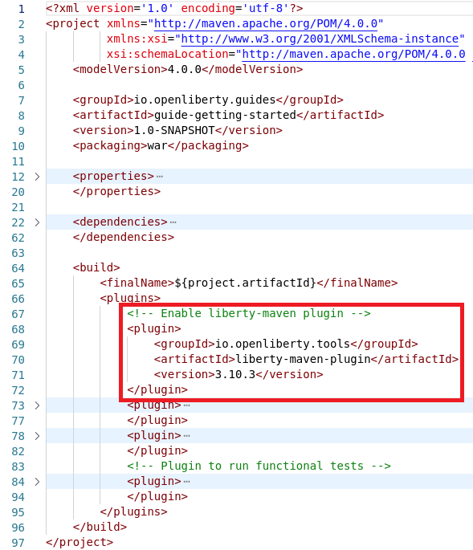

# Lab: Using Open Liberty Tools with VS Code

## Objectives

In this exercise, you will learn how developers can use Liberty in “dev” mode with VS Code Integrated Development Environment for achieving efficient iterative develop, test, debug cycle when developing Java based applications and microservices.

At the end of this lab you should be able to:

  - Experience using the Open Liberty Tools extension available in VS
    Code to efficiently develop, test, and debug Java cloud native
    applications.

  - Experience hot reloading of application code and configuration
    changes using dev mode

You will need an estimated **60 to 90 minutes** to complete this lab.

## Lab requirements

  - Use the lab environment that we prepared for this lab. It already has the prerequisite software installed and configured.
    
## Introduction – Open Liberty Tools extension for VS Code

In a separate lab, you learned how Open Liberty dev mode can be run from a command line while allowing you to edit your code with any text editor or IDE.

In this lab, you will use the “**Open Liberty Tools”** **VS Code
extension** to start Open Liberty in development mode, make changes to
your application while the server is up, run tests and view results, and
even debug the application without leaving the editor.

Your code is automatically compiled and deployed to your running server,
making it easy to iterate on your changes.

The Open Liberty Tools for VS Code contains the following key Features

  - View **liberty-maven-plugin projects** in the workspace (version 3.1
    or higher)

  - View **liberty-gradle-plugin projects** in the workspace (version
    3.0 or higher)

  - Start/Stop Open Liberty Server in dev mode

  - Start Open Liberty Server dev mode with custom parameters

  - Run Unit and Integration tests

  - View unit and integration test reports

The Open Liberty Tools for VS Code has a dependency on the **Tools for
MicroProfile** VS Code extension to support the development of MicroProfile based microservices.

The **Tools for MicroProfile** VS Code extension has dependencies on the following:

  - Java JDK (or JRE) 11 or more recent

  - Language Support for Java by Red Hat VS Code extension.

### **Liberty Maven Plugin**

The **Liberty Maven Plugin** provides several goals for managing a
Liberty server and applications.

Maven 3.5.0 or later is recommended to use the Liberty Maven Plugin.

Enabling the Liberty Maven Plugin in your project, simply add the
following XML Stanza to your **pom.xml** file.

For detailed infromation about the Maven goals supported by the Liberty
Maven Plugin, visit:

<https://github.com/OpenLiberty/ci.maven>

### **Interacting with dev mode**

Once the **Liberty Maven Plugin** is specified in your **pom.xml** file,
your project name is then listed under the **Liberty Dev Dashboard** in
the side panel in VS Code, as illustrated below.

You can interact with dev mode by right-clicking on your project name
and selecting one of the commands supported by the Open Liberty Tools
extension.

> 

### **Liberty dev mode Commands**

The following commands can be selected from the drop-down menu after
right-clicking on your project name in the Liberty Dev Dashboard.

     

## Accessing the lab environment

If you are doing this lab as part of an instructor led workshop (virtual or face to face), an environment has already been provisioned for you. The instructor will provide the details for accessing the lab environment.

Otherwise, you will need to reserve an environment for the lab. You can obtain one here. Follow the on-screen instructions for the “**Reserve now**” option.

<https://techzone.ibm.com/my/reservations/create/660d7f062945d2001e009449>

 The lab environment contains one (1) Linux VM, named **Workstation**.

  
    
  The Ubuntu Linux **Workstation** VM has the following software installed for the lab:
  
  - Maven 3.6.0 
  - IBM Semeru Runtime Open Edition 17.0.8.1
  - Visual Studio Code 1.85.1

   

1. Access the lab environment from your web browser. 
    
    A `Published Service` is configured to provide access to the **Workstation** VM through the noVNC interface for the lab environment.
    
    a. When the demo environment is provisioned, click on the **environment tile** to open its details view. 

    b. Click on the **Published Service** link which will display a **Directory listing**  
    
    c. Click on the **"vnc.html"** link to open the lab environment through the **noVNC** interface. 
    
    
    
    d. Click the **Connect** button 
    
      

    e. Enter the password as:  **`IBMDem0s!`**. Then click the **`Send Credentials`** button to access the lab environment. 

    > Note: That is a numeric zero in IBMDem0s!  

      <kbd></kbd>

	 
	  

2. If prompted to Login to the "workstation" VM, use the credetials below: 

    The login credentials for the **workstation”** VM is:
 
     - User ID: **techzone**

     - Password: **IBMDem0s!**

     > Note: That is a numneric zero in the password

	  
 
     <kbd></kbd>
	 
	  
	
3.  Once you access the **Student VM** through the published service, you will see the Desktop, which contains all the programs that you will be using (browsers, terminal, etc.)

   

|         |           |  
| ------------- |:-------------|
|    | 
<strong>IMPORTANT:</strong>

Using the lab environment provided, all the required VS code extensions and dependencies have been installed for you.

This allows you to focus on the value of using the capabilities of the tools for fast, efficient inner-loop development, test, debug, of Java based applications and Microservices using Open Liberty in dev mode.

 |
   

## Tips for working in the lab environment     

1. You can resize the viewable area using the **noVNC Settings** options to resize the virtual desktop to fit your screen.

    a. From the environemnt VM, click on the **twisty** on the noNC control pane to open the menu.  

    

    b. To increase the visible area, click on `Settings > Scaling Mode` and set the value to `Remote Resizing`
      
     

2.  You can copy / paste text from the lab guide into the lab environment using the clipboard in the noVNC viewer. 
   
    a. Copy the text from the lab guide that you want to paste into the lab environment
    
    b. Click the **Clipboard** icon and **paste** the text into the noVNC clipboard

    
    
    c. Paste the text into the VM, such as to a terminal window, browser window, etc. 

    d. Click on the **clipboard** icon again to close the clipboard

    > **NOTE:** Sometimes pasting into a Terminal window in the VM does not work consistently. 
    
    > In this case you might try again, or open another Terminal Window and try again, or  paste the text into a **Text Editor** in the VM, and then paste it into the Terminal window in the VM. 

3. An alternative to using the noVNC Copy / Paste option, you may consider opening the lab guide in a web browser inside of the VM. Using this method, you can easily copy / paste text from the lab guide without having to use the noVNC clipboard. 

   

<!-- LBH: Added description how to access toolbar -->
4. Click on the **`Activities`** icon within the VM to switch between different windows or get access the tool bar.
    <kbd></kbd>

    You will see the toolbar.

    <kbd></kbd>
    
     

### If, at aytime during the lab, you ar asked to install updates, click CANCEL!

|         |           |  
| ------------- |:-------------|
|    | 
<strong>Important:</strong> 
<strong>Click CANCEL</strong>…. If, at any time during the lab, you get a pop-up asking to install updated software onto the Ubuntu VM.
 
The one we experience is an update available for VS Code.

<strong>CLICK CANCEL!</strong>

 |

## Getting Started with Open Liberty Tools in VS Code

**Liberty Dev mode** allows you, as the developer, to focus on your
code. When Open Liberty is running in dev mode, your code is
automatically compiled and deployed to the running server, making it
easy to iterate on your changes.

In this lab, as a developer, you will experience using the **Open
Liberty Tools** extension in **VS Code** to work with your code, run
tests on demand, so that you can get immediate feedback on your changes.

You will also work with integrated debugging tools and attach a Java
debugger to debug your running application.

From a developer perspective, this is a huge gain in efficiency, as all
these iterative inner-loop development activities occur without ever
leaving the integrated development environment (IDE).

 

### **Review the VS Code extensions and projects pom.xm file used for this project**

The sample application used in this lab is configured to be built with
Maven. Every Maven-configured project contains a pom.xml file, which
defines the project configuration, dependencies, plug-ins, and so on.

Your pom.xml file is in the root directory of the project and is
configured to include the **liberty-maven-plugin**, which allows you to
install applications into Open Liberty and manage the server instances.

To begin, navigate to the project directory and review the IDE
extensions and pom.xml file that is used for the “**system”**
microservice that is provided in the lab.

First, add the project folder to a VS Code Workspace

1.  **Close** all **Terminal** windows and **Browser** Tabs used in any previous lab.

2.  Use the **Activities** Icon to switch to the toolbar, then click the **Terminal** icon to open a Terminal window.

    <!-- LBH: Updated description how to access toolbar -->

    <kbd></kbd>

3.  Clone the GitHub repo that includes artifacts required for this lab
    <!-- LBH: Adjusted lab to use Student folder instead of home to store content -->

        mkdir -p /home/techzone/Student/labs

        git clone https://github.com/openliberty/guide-getting-started.git /home/techzone/Student/labs/vscode
        
        cd /home/techzone/Student/labs/vscode

    Once completed, the local lab artifacts repo is cloned at the following directory on the desktop VM. 
    
    > **/home/techzone/Student/labs/vscode**
2.  Navigate to the project directory and launch VS Code from the **start**” folder of the project.
    
    a.  Open a terminal window and change to the following directory:

        cd /home/techzone/Student/labs/vscode/guide-getting-started/start

    

3.  Launch VS Code using the current directory as the root folder for
    the workspace

        code .

    When the VS Code UI launches, the Explorer view is shown. The “START” folder contains the source code for the project.

    

     

4.  Review the installed extensions in VS Code that are used for this lab.
    
    a.  Click on the **Extensions** icon in the left navigation bar in
        VS Code.
        
    
    
    b.  Expand the “INSTALLED” extensions section to list the extensions that are currently installed in this environment. The notable extensions used in this lab are:
        
    -  Open Liberty Tools
    -  Tools for MicroProfile
    -  Language Support for Java
    -  Debugger for Java
    
     

    c.  Click on the “**open Liberty Tools**” extension to view its details.
    
    d.  Notice the list of commands that are supported by the Open
        Liberty Tools extension.
        
    
    
    e.  Scroll down to the “**Requirements**” section of the Open
        Liberty Tools details page.
        
    Notice the requirement for “Tools for MicroProfile” to support development of Microservices that use MicroProfile APIs with   Open Liberty.
        
    

    |         |           |  
    | ------------- |:-------------|
    |    | 
<strong>Information:</strong>

The <strong>Tools for MicroProfile</strong> extension requires the components to be installed in the environment:

 |

    f.  **Close** the Open Liberty Tools Extension details page.

     

5.  Review the **pom.xml** file used to configure and build the "system” microservice.
    
    a.  Click on the **Explorer** icon  located on the left navigation bar in VS Code.
    
    b.  Expand the **START** folder if it is not already expanded
        
    
    
    c.  Click on the **pom.xml** file to open it in the editor pane
    
    d.  Close any Pop-up boxes asking if you want to install extensions
        or switch views.
        
    **Note:** You may see additional pop-ups, just close them, or    ignore them.
        
    
    
    e.  Note the binary packaging of the Java application war file that
        is produced from the Maven Build. The WAR file produced will be
        named **guide-getting-started** version 1.0-SNAPSHOT.
        
    
    
    f.  Default HTTP and HTTPS Ports are defined, and substituted into
        the server.xml file
        
    
    
    g.  The Open Liberty Tools Plugin is enabled, with a supported   version of 3.3.4
        
    
    
    h.  Plugin for running Tests is also added to the Maven       configuration, that leverage the testing dependencies also        defined in the pom.xml file.
        
    
    
    i.  **Close** the pom.xml file

     

    |         |           |  
    | ------------- |:-------------|
    |    | 
<strong>Information:</strong>

<strong>Tip:</strong> Additional information on the liberty-maven-plugin can be found here:

<a href="https://github.com/OpenLiberty/ci.maven">https://github.com/OpenLiberty/ci.maven</a>
 |

     

## Using Open Liberty Tools in VS Code 

In this section of the lab, you will use the **Open Liberty Tools i**n
**VS Code** to work with your code and run tests on demand, so that you
can get immediate feedback on your changes.

|         |           |  
| ------------- |:-------------|
|    | 
<strong>Important:</strong>

<strong>For Open Liberty Tools</strong> (LIBERTY DEV DASHBOARD)

VS Code provides extensions for Java to support the Java language features.

VS Code for Java supports two modes.
<ul><li>
Lightweight mode
</li><li>
Standard mode
</li></ul>
VS Code has a default configuration called “hybrid mode” where a workspace is opened in Lightweight mode, but as needed, you are prompted to switch to Standard mode.

The <strong>Tools for MicroProfile</strong> Extension, which is required for the <strong>Open Liberty Tools</strong> extension, requires the Java workspace to be opened in “<strong>STANDARD</strong>” mode. Otherwise the LIBERTY DEV DASHBOARD will not function properly.

<strong>Tip:</strong> In this lab environment, the workspace is already configured to use Standard mode.

For more details on VS Code for Java is available here: <a href="https://code.visualstudio.com/docs/java/java-project">https://code.visualstudio.com/docs/java/java-project</a>
 |

1.  Use the Liberty Dev Dashboard to **start** the Liberty Server in dev mode
    
    a.  In VS Code, expand the LIBERTY DEV DASHBOARD section
    
    b.  Right-mouse click on the **guide-getting-started** Liberty
        Server
    
    c.  Select **Start** from the menu to start the server
        
    
    
    d.  The Terminal view opens, and you see the server log messages as
        the server starts. When the following message appears in the Terminal, the Liberty server is started.
        
    

     

2.  Run the system Properties sample application from a web browser
    
    a.  Open the Web Browser from inside of the VM
    
    b.  Go to <http://localhost:9080> to verify the application is     running.
        
    

     

### **Developer experience Using Open Liberty Tools in VS Code** 

The System Properties Sample application is up and running in the
Liberty server.

Next, as a developer, you want to implement a health check for the
application.

The developer experience is frictionless, as all code and configuration
change the developer introduces, are automatically detected and the
server and application are dynamically updated in the running server to
reflect the updated code and configuration.

Let’s explore a couple of examples of the very efficient developer
experience by implementing some new capability into our service.

In this example, you will leverage the **mpHealth-2.2** feature in Open
Liberty, which implements the MicroProfile mpHealth-2.2 API, to
implement the new health checks for the application.

The **mpHealth-2.2** feature provides a **/health** endpoint that
represents a binary status, either UP or DOWN, of the microservices that
are installed.

To learn more about the MicroProfile mpHealth feature, visit:
<https://www.openliberty.io/docs/21.0.0.4/health-check-microservices.html>

1.  Update the Liberty server configuration file (server.xml) to include the mpHealth-2.2 feature to begin implementing the health checks for the application.
    
    a.  In the VS Code Explorer view, navigate to **START** -> **src** -> **main** -> **liberty / config**
    
    b.  Click on **server.xml** to open the file in the editor pane
        
    
    
    c.  Add the **mpHealth-2.2** feature to the server.xml file using the text below:

        <feature>mpHealth-2.2</feature>

    
 
     

    d.  **Save** and **Close** the server.xml file
    
    When the server.xml file is saved, the configuration changes are
    detected, and the server is dynamically updated, installing the new
    feature and updating the application in the running server.

     

2.  View the messages in the **Terminal** view, showing the feature being installed and the application being updated.
    
    
    
    Once the changes are saved, and the server is automatically updated,
    the new /**health** endpoint is available.

     

3.  From the Web browser in the VM access the **/health** endpoint to view the health status of the application.

        http://localhost:9080/health

    

     

    Currently, the basic health check provides a simple status indicating if the service is running, but not if it is healthy.

    In the next steps, you will implement a **liveness** check that implements logic that gathers memory and cpu usage information and reports the service DOWN in the health check if the system resources exceed a certain threshold.

    You will also implement a **readiness** check that checks external property configuration in the server.xml file, that is used to place the service in maintenance mode. And if the service is in maintenance mode, the service is marked DOWN from the health check.

     

4.  Copy an implementation of the **SystemReadinessCheck.java** to the project
    
    a.  Open a Terminal window  on      the VM
    
    b.  Run the following command to copy the **SystemReadinessCheck.java** to the project

        cp /home/techzone/Student/labs/vscode/guide-getting-started/finish/src/main/java/io/openliberty/sample/system/SystemReadinessCheck.java /home/techzone/Student/labs/vscode/guide-getting-started/start/src/main/java/io/openliberty/sample/system/SystemReadinessCheck.java

    |         |           |  
    | ------------- |:-------------|
    |    | 
<strong>Information:</strong>

For the purposes of the lab, the copy command above copies a fully implemented Readiness check from the “finished” project, into the current working project.
 |

5.  Review the **SystemReadinessCheck.java i**mplementation
    
    a.  Return to the VS Code Explorer view
    
    b.  Navigate to **START \> main \> java / io / openliberty / sample
        / system**
    
    c.  Click on the **SystemReadinessCheck.java** file to open it in
        the editor pane
        
    
        
    The SystemReadinessCheck simply evaluates the **“inMaintenance**” ConfigProperty, which is implemented via the mpConfig MicroProfile feature, and configured in the Liberty Server’s server.xml file.
    
    - If the “inMaintenance” property is set to “**false**” the
        readiness check sets the Health Status to **UP**.
    
    - If the inMaintenance property is set to “**true**” the status is
        set to **DOWN**.

     

6.  From the Web Browser in the VM, rerun the **/health** endpoint to view the health status of the application.

        http://localhost:9080/health

    

    |         |           |  
    | ------------- |:-------------|
    |    | 
<strong>Information:</strong>

Did you notice that while implementing the new readiness check code in the application, that you did not have to restart the application or Liberty Server?

The Open Liberty Tools detected the code changes in the project, and dynamically updated the application in the running server.

 |

7.  Copy an implementation of the **SystemLivenessCheck.java** to the project
    
    a  Open a Terminal window  on        the VM
    
    b.  Run the following command to copy the **SystemLivenessCheck.java** to the project

        cp /home/techzone/Student/labs/vscode/guide-getting-started/finish/src/main/java/io/openliberty/sample/system/SystemLivenessCheck.java /home/techzone/Student/labs/vscode/guide-getting-started/start/src/main/java/io/openliberty/sample/system/SystemLivenessCheck.java

    |         |           |  
    | ------------- |:-------------|
    |    | 
<strong>Information:</strong>

For the purposes of the lab, the copy command above copies a fully implemented Liveness check from the “finished” project, into the current working project.
 |

8.  Review the **SystemLivenessCheck.java i**mplementation
    
    a.  Return to the VS Code Explorer view
    
    b.  Navigate to **START** -> **main** -> **java / io / openliberty / sample / system**
    
    c.  Click on the **SystemLivenessCheck.java** file to open it in the
        editor pane
        
    
        
    The SystemLivenessCheck evaluates the **“memory”** and **“cpu”**    resources used.
        
      - If the “memory” used is less than 90%, the liveness probe sets
        the status to UP.
    
      - If the “memory” used is greater than 90%, the liveness probe
        sets the status to DOWN.

     

9.  From the Web Browser in the VM, rerun the **/health** endpoint to view the health status of the application.

        http://localhost:9080/health

    

    **Note:** in the case where there are multiple health checks being performed, as in our example, ALL the health checks must have the UP status for the service to be marked UP.

    **So, what happens when we change the inMaintenance property to“true”?**

    Let’s modify the external configuration to set the service in maintenance mode and see the results of the health checks.

     

10. Modify the inMaintenance property in the server.xml file
    
    a.  Return to the VS Code console and navigate to **START** -> **src** -> **main -> liberty / config**
    
    b.  Click on **server.xml** to open the file in the editor
    
    c.  Modify the inMaintenance variable value to “**true**” as
        illustrated below
    
    d.  **Save** the server.xml file. The server configuration is
        dynamically updated to reflect the update.
        
    

     

11. From the Web Browser in the VM, rerun the **/health** endpoint to view the health status of the application.

        http://localhost:9080/health

    

     

12. In the server.xml file, change the inMaintenance variable back to false”
    
    a.  **Save** the server.xml file
    
    b.  **Close** the server.xml editor view
        
    

      

13. Rerun the **/health** endpoint to verify the service is now marked UP again.
    

 
